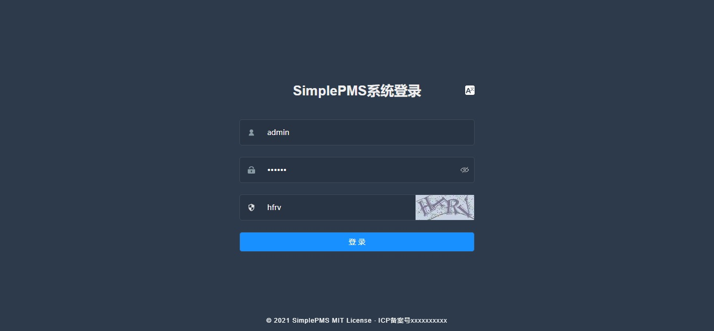
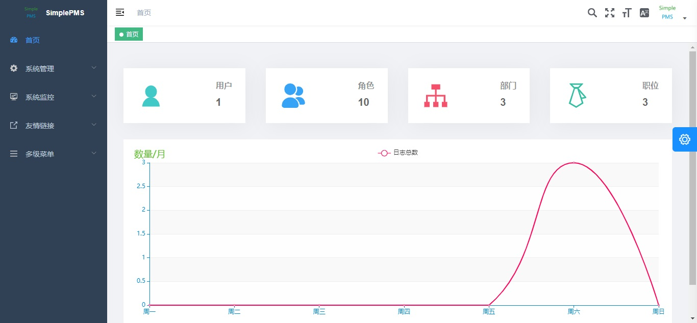
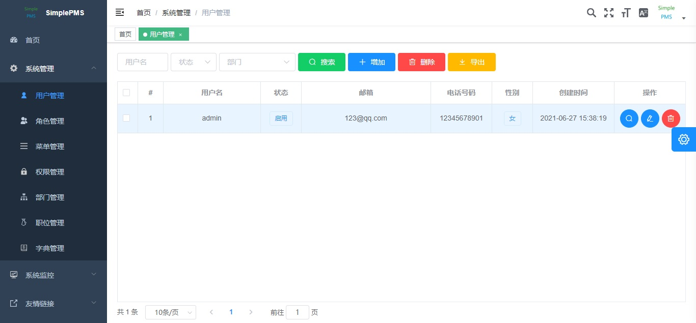

# 介绍
一个简单的权限管理系统，采用前后端分离体系，后端Spring全家桶，前端Vue全家桶，简单、易上手。

[预览地址](http://47.108.216.225/)。

# 软件架构
## 后端

Spring、SpringBoot、Spring MVC、MyBatis Plus、JWT。

## 前端

Vue、Vue Router、Vuex、I18N。


# 安装教程

1.  安装MySQL 5.7或更高版本，创建`simple_pms`数据库，字符集`utf8mb4`，排序规则`utf8mb4_general_ci`，在`simple_pms`数据库导入`backend/assets/simple_pms.sql`备份文件。
2.  安装Redis。
3.  克隆项目。Gitee：`git clone https://gitee.com/wanglunhui/simple-pms`，Github：`git clone https://github.com/wanglunhui2012/SimplePMS`。
4.  导入项目，推荐使用[IntelliJ IDEA](https://www.jetbrains.com/idea/)打开后端`backend`项目，使用[WebStorm](https://www.jetbrains.com/webstorm/)打开前端`frontend`项目。
5.  对于后端`backend`项目，等待下载依赖，下载完成后修改`src/main/resources/config/application-dev.yml`中的MySQL和Redis连接的地址、用户名和密码，运行`SimplePMSApplication.java`。
6.  对于前端`frontend`项目，先切换到对应目录`cd frontend`，再安装依赖`npm install`，运行`npm run dev`。

# 打包教程

## 后端

先将`application.yml`中的`spring.profiles.active`改为pro（本地开发的话为dev，对应`application-pro.yml`文件），再修改`application-pro.yml`的MySQL和Redis连接的地址、用户名和密码，执行下面命令：

```bash
cd backend
gradle clean
gradle bootJar -Dfile.encoding=UTF-8
```

之后就能在`backend/build/libs/SimplePMS-0.0.1-SNAPSHOT.jar`下找到打包文件，放到服务器下后使用`nohup java -jar SimplePMS-0.0.1-SNAPSHOT.jar &`即可运行。

## 前端

```
cd frontend
npm run build:prod
```

之后就能在`frontend/dist/`下找到打包文件，放到服务器下的`/usr/share/nginx/html`即可（服务器先安装Nginx，且Nginx配置对应`frontend/nginx.conf`文件）。

# 使用说明








# 参与贡献

1.  Fork 本仓库
2.  新建 Feat_xxx 分支
3.  提交代码
4.  新建 Pull Request

# 交流群

<center class = "half">
	
	
</center>

# 感谢

- [PanJiaChen/vue-element-admin: A magical vue admin https://panjiachen.github.io/vue-element-admin](https://github.com/PanJiaChen/vue-element-admin)：很漂亮的前端模板。
- [RuoYi-Vue: 基于SpringBoot，Spring Security，JWT，Vue & Element 的前后端分离权限管理系统 (gitee.com)](https://gitee.com/y_project/RuoYi-Vue)：很好的一个系统，一些思路参考该项目。

# 关于我

闲人一个，没事就参照一些项目做出来的，有想要进行项目合作的可以联系我（QQ：1396509884，微信：wlh15171478698）。

